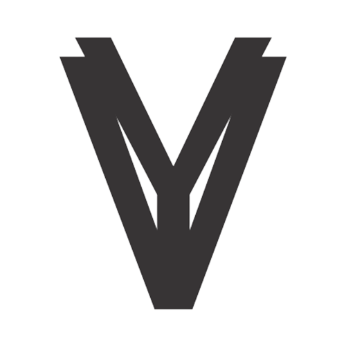

<p align="center"><a href="https://laravel.com" target="_blank"></a></p>

<p align="center">


<a href="https://www.codacy.com/gh/rdp77/veyaz/dashboard?utm_source=github.com&amp;utm_medium=referral&amp;utm_content=rdp77/veyaz&amp;utm_campaign=Badge_Grade"></a>
<a href="https://github.com/rdp77/veyaz/actions/workflows/laravel.yml"></a>

<a href="https://github.com/rdp77/veyaz/blob/master/LICENSE"></a>
</p>

## Requirement

- [Composer](https://getcomposer.org/).
- [Node JS](https://nodejs.org/en/) (Optional).
- Code editor for doing coding activities [Visual Studio Code](https://code.visualstudio.com/) or [Sublime](https://www.sublimetext.com/) or [Atom](https://atom.io/).
- Php and Web server for running laravel in web browser, can use [XAMPP](https://www.apachefriends.org/) or [Laragon](https://laragon.org/).
- Database Management System.

Because it uses Laravel migrations feature it can use any type of DBMS as long as it's a Relational Database.

## Getting Started

1. Clone repository with the command `git clone https://github.com/rdp77/veyaz.git`
2. Installing package form Composer with command `composer install`
3. Installing package module node js with command `node install` (Optional)
4. Run command `php artisan veyaz:start`
5. Running web application using commands `php artisan serve` or running manually with web server.

Login using username `admin` and password `admin`

## Command Reference

```
  php artisan command:name
```

| Name          | Description               |
| :------------ | :------------------------ |
| `veyaz:start` | Setup Veyaz               |
| `veyaz:con`   | Setup Connection Database |
| `veyaz:db`    | Database Import           |

## Third-party Library

This template uses several libraries as helpers to improve the template, and can be seen [here](/library.md)

## Code of Conduct

In order to ensure that the Laravel community is welcoming to all, please review and abide by the [Code of Conduct](https://laravel.com/docs/contributions#code-of-conduct) or veyaz [Code of Conduct](https://github.com/rdp77/veyaz/blob/master/CODE_OF_CONDUCT.md).

## Security Vulnerabilities

If you discover a security vulnerability within Laravel, please send an e-mail to Taylor Otwell via [taylor@laravel.com](mailto:taylor@laravel.com). All security vulnerabilities will be promptly addressed.

## License

The Laravel framework is open-sourced software licensed under the [MIT license](https://opensource.org/licenses/MIT).